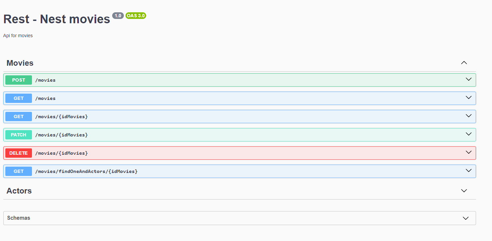

# Rest Nest Movie (Nest.js + TypeORM + SQLite)

A REST API for registering your favorite movies.

## What Does It Do?

This application was created to demonstrate knowledge in the Nest.js back-end framework. The functionality created is a CRUD system where you can create "movies" and their "actors".

## Getting Started

You need to have Node.js >=18.19 installed on your PC.

Then you can run the command:

`npm install` ou `yarn install`

Once that's done, rename the .env-example file to .env, and if needed, change the PORT variable (the port on which the API will run).

## Application Details

## Swagger

Swagger is used for the REST API documentation. To access the API documentation, go to: `http://localhost:{PORT}/docs`

You will see something like this:



## SQLite

To persist data and avoid the need to install a database on your machine, SQLite was defined as the database. When the application starts, the database is created.

## TypeORM

TypeORM is used for database communication, entities, and relationships.

The `.entity` files mirror the database tables.

## Relationships Between Movies and Actors Tables

We use a one-to-many relationship between movies and actors.

To do this, we use TypeORM decorators, which you can check in the [movies.entity](./src/modules//movies//entities//movie.entity.ts#L28) or [actors.entity](./src/modules//actors//entities//actor.entity.ts#L21) files.

By establishing relationships between the tables in the entities, we can use TypeORM's `innerJoin` and `leftJoin` functionalities. You can check this in the [movies.service](./src/modules//movies//movies.service.ts#L134) file.

## BaseCrud Interface

I created the [BaseCrud](./src/interfaces//base-crud.ts) interface to maintain consistency between modules and follow the interface segregation principle of SOLID. Thus, the two services will have methods with the same name for similar functionalities, as the only difference between them is the table.

## HttpResponse<T> Interface

I decided to create the [HttpResponse< T >](./src/interfaces//http-response.ts) interface to standardize the application's output data.

## Exception Filters

According to the Nest.js documentation, "exception filters are designed exactly for this purpose. They allow you to control the exact flow of control and the content of the response sent back to the client."

In our application, the filters folder contains the exception filter where we capture, handle, and return errors to the client. Thus, we can use `throw new Error('')` freely in our application. For example, you can check the createValidate function in the [movies](./src/modules//movies//movies.service.ts#L53) or [actors](./src/modules//actors//actors.service.ts#L41).

## Errors

The movies and actors modules share some validations, such as field length and required fields, where only the field name in the error message changes. To standardize this and use the principle of not repeating code, the [custom-error.ts](./src/const//custom-error.ts) file was created to declare all errors.

## Enumerators

Every movie has one or more genres; in our API, we accept only one. Therefore, I decided to create the [genre](./src/modules//movies//entities//movie.entity.ts#L19) column of type int in the movies table. To make it easier to understand, the [genre.ts](./src/enums/genre.enum.ts) enumerator was created, which specifies some genres of movies, such as action, horror, comedy, among others.

# REST API Created By

```
  _                       _         _ _           _    _
 | |                     | |       | (_)         | |  (_)
 | |_   _  ___ __ _ ___  | | ____ _| |_ _ __  ___| | ___
 | | | | |/ __/ _` / __| | |/ / _` | | | '_ \/ __| |/ / |
 | | |_| | (_| (_| \__ \ |   < (_| | | | | | \__ \   <| |
 |_|\__,_|\___\__,_|___/ |_|\_\__,_|_|_|_| |_|___/_|\_\_|

```
