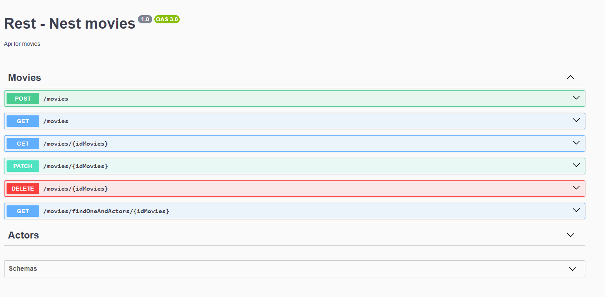

# Rest Nest Movie (Nest.js + TypeORM + SQLLite)

Uma api rest para cadastrar seus filmes favoritos.

# O que isso faz?

Essa aplicação foi criada para demonstrar conhecimentos no framework de back-end nest.js. A funcionalidade criada é um C.R.U.D em que você pode criar "filmes" e os seus "atores".

# Primeiros passos

É necessário você ter instalado em seu PC o node.js >=18.19.

Em seguida você pode rodar o comando:

`npm install` ou `yarn install`

Feito isso, renomeie o arquivo .env-example para .env, caso lhe convenha altere a variavel PORT (porta que a api ira rodar).

# Detalhes da aplicação

## Swagger

Para documentação da api rest foi utilizado o swagger. Para acessar a documentação da api basta acessar: `http://localhost:{PORT}/docs`

Algo assim será mostrado:



## SQLLite

Para persistência dos dados e que você não tenha que instalar um banco de dados na sua máquina defini o SQLLite como banco de dados, logo ao iniciar a aplicação o banco de dados é criado.

## TypeORM

Para comunicação com banco de dados, entidades e relações foi usado o typeorm.

Os arquivos `.entity` espelham as tabelas do banco de dados.

Os arquivos providers ...

### Relações entre tabelas movies e actors

Usamos a relação de 1 para muitas entre movies e actors.

Para isso usamos os decorators do typeorm, você pode verificar nos arquivos [movies.entity](./src/modules//movies//entities//movie.entity.ts#L28) ou [actors.entity](./src/modules//actors//entities//actor.entity.ts#L21).

Ao fazer a relação entre as tabelas nas entitys, é possivel usarmos as funcionalidades `innerJoin` e `leftJoin` do typeorm. Você pode verificar no arquivo [movies.service](./src/modules//movies//movies.service.ts#L134)

## Interface BaseCrud

Criei a interface [BaseCrud](./src/interfaces//base-crud.ts) para manter um padrão entre os módulos e seguir o princípio de segregação de interface do SOLID. Nesse sentido, os dois services terão métodos com mesmo nome para funcionalidades parecidas, já que a unica diferença entre as duas é somente a tabela.

## Interface HttpResponse < T >

Decidi criar a interface [HttpResponse< T >](./src/interfaces//http-response.ts) para padronizar os dados de saída da aplicação.

## Filtros de exceção

Conforme documentação do nest.js, "os filtros de exceção são projetados exatamente para esse propósito. Eles permitem que você controle o fluxo exato de controle e o conteúdo da resposta enviada de volta ao cliente".

Na nossa aplicação, a pasta filters contem o filtro de excessões em que capturamos e tratamos e retornamos os erros para o cliente. Nesse caso, podemos usar `throw new Error('')` em nossa aplicação livremente. A exemplo disso, você pode verificar a função createValidate nos modulos [movies](./src/modules//movies//movies.service.ts#L53) ou [actors](./src/modules//actors//actors.service.ts#L41).

## Padronização de erros

Os módulos movies e actors compartilham algumas validações, como tamanho de campo e obrigatoriedade, em que só alternava na mensagem de erro o nome do campo. Logo, para padronizar isso e usar o principio de não repetir códigos, foi criado o arquivo [custom-error.ts](./src/const//custom-error.ts) em que estão declarados todos os erros.

## Enumeradores

Todo filme tem um ou mais gêneros, na nossa api aceitamos somente um. Nesse sentido, decidi criar na tabela movies a coluna [genre](./src/modules//movies//entities//movie.entity.ts#L19) do tipo int e para ficar mais facil o entendimento foi criado o enumerador [genre.ts](./src/enums/genre.enum.ts) que especifica alguns generos de filmes, como ação, terror, comédia entre outros.

# Api rest criada por

```
  _                       _         _ _           _    _
 | |                     | |       | (_)         | |  (_)
 | |_   _  ___ __ _ ___  | | ____ _| |_ _ __  ___| | ___
 | | | | |/ __/ _` / __| | |/ / _` | | | '_ \/ __| |/ / |
 | | |_| | (_| (_| \__ \ |   < (_| | | | | | \__ \   <| |
 |_|\__,_|\___\__,_|___/ |_|\_\__,_|_|_|_| |_|___/_|\_\_|

```
